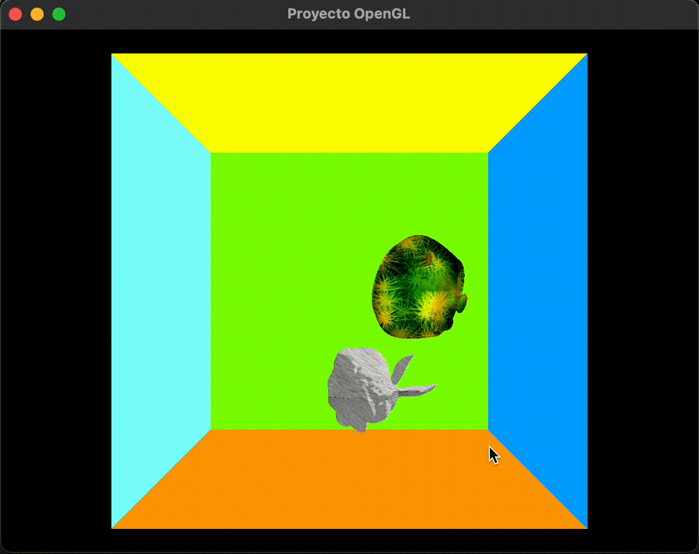

# Proyecto 1 de graficacion

Librerias Necesarias:

* OpenGL
* glu
* glew
* glm
* glut
* Qt
* qmake
* make

Para clonar el proyecto, haganlo con `git clone --recursive` para que los submodulos se clonen tambien.

## Compliacion

```sh
qmake
make
./Proyecto
```

## Instrucciones de uso

Para prender o apagar la luz, presione la tecla `L`.

Mueva la rueda del mouse para hacer zoom en la escena.


## Ventajas y otras notas

Se penso en la disminucion de dependencias fuertes como lo es `QT` para que se pueda usar independientemente de la libreria que maneje el vewport.

Uso de header only libraries para minimizar instalaciones.
